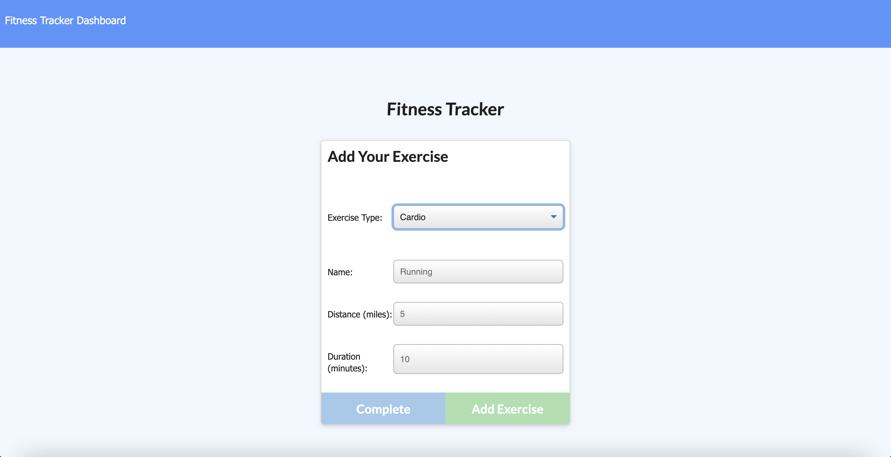
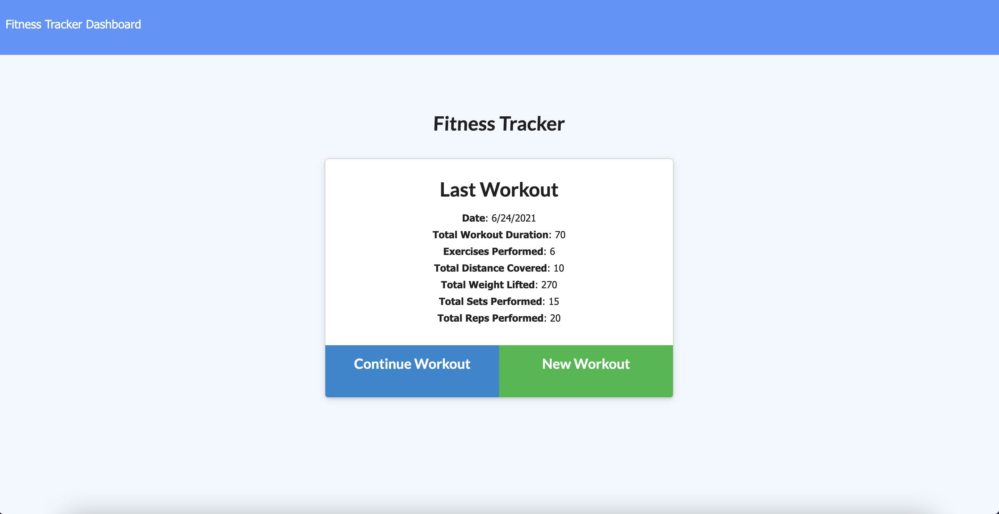

# fitness-tracker


[](https://opensource.org/licenses/MIT)


## Table of Contents
- [Description](#Description)
- [Screenshots](#Screenshots)
- [User Story](#User-Story)
- [Acceptance Criteria](#Acceptance-Criteria)
- [Deployed Application URL](#Deployed-Application-URL)


## Description 
This is a Workout Tracker app that can be used to view, create and track daily workouts. The focus of this assignment was to create Mongo database with a Mongoose schema and handle routes with Express. 


## Screenshots




## User Story 
```
* As a user, I want to be able to view create and track daily workouts. I want to be able to log multiple exercises in a workout on a given day. I should also be able to track the name, type, weight, sets, reps, and duration of exercise. If the exercise is a cardio exercise, I should be able to track my distance traveled.
```


## Acceptance Criteria
```
When the user loads the page, they should be given the option to create a new workout or continue with their last workout.

The user should be able to:

  * Add exercises to the most recent workout plan.

  * Add new exercises to a new workout plan.

  * View the combined weight of multiple exercises from the past seven workouts on the `stats` page.

  * View the total duration of each workout from the past seven workouts on the `stats` page.
```


## Deployed Application URL 
[Fitness Tracker](https://fitness-tracker-app-deployed.herokuapp.com/)